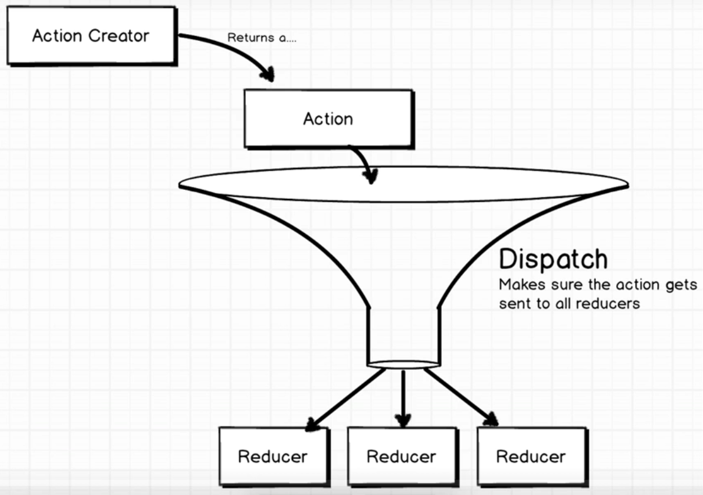
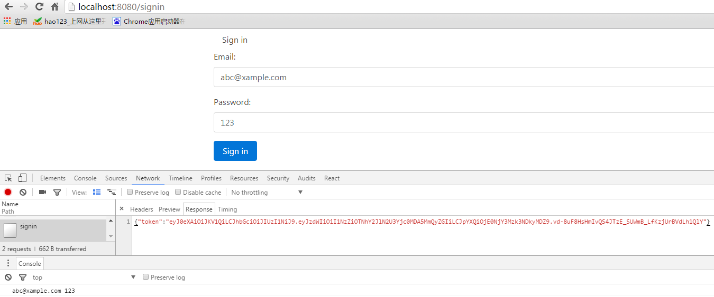

Signin的整个过程是这样的：

 

 

使用redux thunk可以一次处理多个action，对dispatch可以更加细粒度的控制。大致是这样的：

 

- dispatch要做的事是把所有的action交给reducer,并让createStore所有的注册事件再发生一遍

 

> npm install redux-thunk --save

 

> redux-thunk是个中间件，需要注册，在src/index.js中

 

	import React from 'react';
	import ReactDOM from 'react-dom';
	import { Provider } from 'react-redux';
	import { createStore, applyMiddleware } from 'redux';
	import { Router, Route, IndexRoute, browserHistory } from 'react-router';
	import reduxThunk from 'redux-thunk';
	
	import App from './components/app';
	import Signin from './components/auth/signin';
	import reducers from './reducers';
	
	const createStoreWithMiddleware = applyMiddleware(reduxThunk)(createStore);
	
	ReactDOM.render(
	  <Provider store={createStoreWithMiddleware(reducers)}>
	    <Router history={browserHistory}>
	        <Route path="/" component={App}>
	            <Route path="signin" component={Signin} />
	        </Route>
	    </Router>
	  </Provider>
	  , document.querySelector('.container'));

 

> 在C:\Program Files\MongoDB\Server\3.2\bin中运行mongod命令，打开Mongodb数据库

 

> 来到服务端所在目录，运行`npm run dev`

 

好了，Mongodb数据库打开，服务端打开了。

 

> 来到客户端项目所在目录，运行`npm install axios --save`

 

> 为了让服务端支持CROS，来到服务端所在的项目根目录

 

> npm install cors --save

 

> 服务端项目中， index.js

 

	const express = require('express');
	const http = require('http');
	const bodyParser = require('body-parser');
	const morgan = require('morgan');
	const app = express();
	const router = require('./router');
	const mongoose = require('mongoose');
	const cors = require('cors');
	
	//db setup
	const dbUrl = process.env.MONGODB_URI || 'mongodb://localhost:auth/auth'
	mongoose.connect(dbUrl)
	
	//app setup
	app.use(morgan('combined'));
	app.use(cors());
	app.use(bodyParser.json({type: '*/*'}));
	router(app);
	
	
	
	//server setup
	const port = process.env.PORT || 3090;
	const server = http.createServer(app);
	server.listen(port);
	console.log('Server listening on:', port);

 

> 服务端项目中，router.js

 

	const Authentication = require('./controllers/authentication');
	const passportService = require('./services/password');
	const passport = require('passport');
	
	const requireAuth = passport.authenticate('jwt', { session: false });
	const requireSignin = passport.authenticate('local', { session: false });
	
	
	module.exports = function(app){
	    app.get('/', requireAuth, function(req, res){
	       res.send({ message: 'Super secret code is ABC123'});
	    });
	    app.post('/signin', requireSignin, Authentication.signin);
	    app.post('/signup', Authentication.signup);
	}

 

现在，服务端支持CROS了，再次回到客户端项目。

 

首先需要一个action.

> src/actions/index.js

 

	import axios  from 'axios';
	
	const ROOT_URL = 'http://localhost:3090';
	
	
	export function signinUser({email, password}){
	    return function(dispatch){
	        //submit email and password to the server
	        axios.post(`${ROOT_URL}/signin`, { email, password });
	    
	        //if request is good
	        //- update state to indicate user is authenticated
	        //- save the JWT token
	        //- redirect to the route /feature
	
	        //if request is bad
	        // - show an error to the user
	    }
	    
	}
以上，action返回一个函数，而不是通常的类似`{type:FETCH_DATA, payload: result}`之类的，这个就是引用redux-thunk后才允许这么做的。

 

action有了，Signin组件需要和action绑定，并在其表单的onSubmit事件中调用action方法。

 

> src/components/signin.js

 

	import React, { Component } from 'react';
	import { reduxForm } from 'redux-form';
	import * as actions from '../../actions';
	
	class Signin extends Component {
	    
	    
	    handleFormSubmit({email, password}){
	        console.log(email, password);
	        
	        //need to do sth to log user in
	        this.props.signinUser({email, password});
	    }
	    
	    
	    render(){
	        
	        const { handleSubmit, fields: { email, password }} = this.props;
	        
	        return  (
	            <form onSubmit={handleSubmit(this.handleFormSubmit.bind(this))}>
	                <fieldset className="form-group">
	                    <label>Email:</label>
	                    <input {...email} className="form-control" />
	                </fieldset>
	                <fieldset className="form-group">
	                    <label>Password:</label>
	                    <input {...password} className="form-control" />
	                </fieldset>   
	                <button action="submit" className="btn btn-primary">Sign in</button>
	            </form>
	        );
	    }
	}
	
	export default reduxForm({
	    form: 'signin',
	    fields: ['email', 'password']
	}, null, actions)(Signin);

 

现在，客户端向服务端signin,向服务度发送请求，并且应该能返回token.

 

> http://localhost:8080/signin

 

结果，如我们所愿。

 

